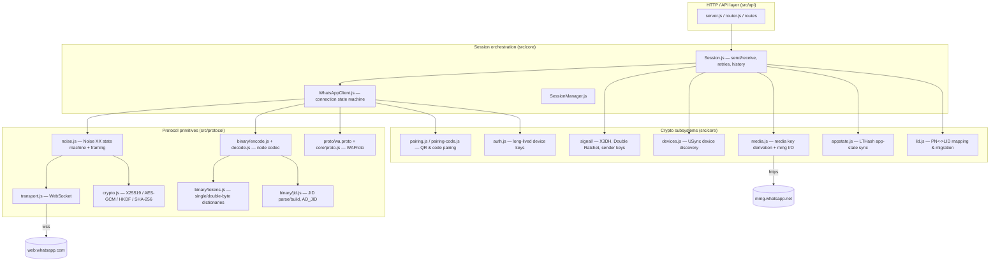

# wapi Architecture

This document is a deep technical walkthrough of how **wapi** speaks the WhatsApp
multi-device protocol natively — from raw WebSocket bytes up to encrypted
messages, group sender keys, app-state mutations, and LID addressing. Everything
above the WebSocket layer (Noise, the binary node codec, WAProto framing, Signal
orchestration, app-state crypto, media crypto) is implemented from scratch in
this repository. The only third-party pieces are `ws` (a neutral WebSocket
transport), `protobufjs` (generic protobuf (de)serialization), and `libsignal`
(used **only** for the XEdDSA/Curve25519 signature primitives and the Double
Ratchet state machine that Node's `crypto` module does not provide).

> **Honest caveats.** This software violates the WhatsApp Terms of Service and
> carries a real risk of account bans — use test numbers only. The protocol core
> (Noise handshake, binary codec, WAProto framing) is verified byte-for-byte
> against the official client, but most higher-level features are verified only
> by offline tests. The phone pairing-code flow is fully wired but has **not**
> been live-tested. Hosted/business accounts are not supported and edge-case
> robustness is limited.

---

## Component overview



The flow of a single outbound text message touches almost every layer: the API
calls `Session.relayMessage`, which discovers devices via **USync**, fetches
**pre-key bundles**, runs each ciphertext through the **Signal** Double Ratchet,
serializes the result as a **binary node**, and hands it to `WhatsAppClient`,
which **zlib**-flags it, encrypts it under the post-handshake **Noise** transport
keys, length-prefixes it, and writes it to the **WebSocket**.

---

## 1. Transport and framing

**Files:** `src/protocol/transport.js`, `src/protocol/noise.js` (framing),
`src/core/WhatsAppClient.js` (flag byte / zlib).

`Transport` is a thin `EventEmitter` over the `ws` library. It connects to
`wss://web.whatsapp.com/ws/chat` with `Origin: https://web.whatsapp.com` and **no
custom `User-Agent`** — the official web client sends only the origin header, and
WhatsApp servers can respond differently to unexpected headers. This is the only
place the third-party `ws` dependency is used; everything carried over the socket
is our own code.

WhatsApp does not put one logical message per WebSocket frame. Instead, a custom
**length-prefixed framing** sits on top of the WebSocket byte stream, implemented
in `NoiseHandler.encodeFrame` / `decodeFrames`:

- Each frame is a **3-byte big-endian length** followed by exactly that many
  payload bytes. `encodeFrame` writes `len >> 16` as one byte then `len & 0xffff`
  as a `UInt16BE`; `decodeFrames` reconstructs `(b0 << 16) | (b1 << 8) | b2`.
- The **very first** frame is prefixed with the 4-byte Noise prologue / header
  `['W','A', 6, 3]` (`'WA'`, edge routing byte `6`, and dictionary version `3` —
  the version of the token dictionary in `tokens.js`). This is sent exactly once
  (guarded by `sentIntro`).
- `decodeFrames` is a buffering reader: it accumulates partial reads in
  `inBuffer` and only emits frames once `3 + size` bytes are available, so a
  single WebSocket `message` event may yield zero, one, or many logical frames.

Once the handshake completes, every frame payload is AES-GCM encrypted under the
transport keys (see §2). **Above** that encryption sits a per-message **flag
byte** (handled in `WhatsAppClient`):

- **Outbound:** `sendNode` prepends a `0x00` flag byte to the encoded binary node
  before Noise encryption (wapi never compresses what it sends).
- **Inbound:** `decompress` reads `frame[0]` as a flags byte; **bit 1 (value
  `2`)** indicates the remaining body is **zlib-deflated** (`inflateSync`). The
  flag byte is always stripped, compressed or not, before the bytes are handed to
  the binary decoder.

So the full inbound pipeline is:
`WebSocket bytes → decodeFrames (length-prefix) → Noise decrypt → strip flag byte → optional zlib inflate → decodeBinaryNode`.

---

## 2. Noise XX handshake

**Files:** `src/protocol/noise.js`, `src/protocol/crypto.js`,
`src/core/WhatsAppClient.js` (`onHandshakeFrame`).

wapi implements the **`Noise_XX_25519_AESGCM_SHA256`** handshake exactly as the
WhatsApp multi-device client uses it. The XX pattern authenticates **both** sides
with static keys that are transmitted (encrypted) during the handshake:

```
Client                                      Server
  -> e                       (ClientHello: ephemeral public)
  <- e, ee, s, es            (ServerHello: ephemeral, encrypted static, cert)
  -> s, se                   (ClientFinish: our encrypted static + ClientPayload)
```

The handshake state lives in `NoiseHandler`; the orchestration of *which*
protobuf goes in each step lives in `WhatsAppClient.onHandshakeFrame`.

### The mode string and its 4 trailing null bytes

```js
const NOISE_MODE = 'Noise_XX_25519_AESGCM_SHA256\0\0\0\0';
this.hash = data.length === 32 ? data : sha256(data);
```

Noise specifies that the protocol name initializes the handshake hash `h`: if the
name is **≤ 32 bytes** it is **zero-padded** to 32 bytes and used verbatim;
otherwise it is SHA-256 hashed. The literal string `Noise_XX_25519_AESGCM_SHA256`
is 28 bytes, so it must be padded with **4 trailing `\0` bytes** to reach exactly
32. By hard-coding the padded form, the code lands on the `length === 32` branch
and uses the bytes directly (no hash) — matching the official client byte for
byte. Getting this padding wrong would desync the handshake hash and every
subsequent GCM authentication tag would fail.

### Core operations

`NoiseHandler` maintains a running handshake hash `h`, a chaining `salt`, the
current `encKey`/`decKey`, and separate read/write GCM counters.

- **`authenticate(data)`** mixes data into the handshake hash:
  `h = SHA256(h ‖ data)`. During the handshake, the header, our ephemeral
  public, the server ephemeral, and every ciphertext are authenticated this way,
  so the final transport keys cryptographically commit to the entire transcript.
- **`mixIntoKey(dh)`** runs `HKDF-SHA256(dh, 64, salt)` and splits it into a new
  `salt` (first 32 bytes) and a new symmetric key (last 32), resetting the GCM
  counters. `mixDH(priv, pub)` is `mixIntoKey(X25519(priv, pub))`.
- **`encrypt` / `decrypt`** use AES-256-GCM with a 12-byte IV (`gcmIv`: 4 zero
  bytes + an 8-byte big-endian counter) and the **handshake hash as the GCM
  AAD**, then authenticate the ciphertext back into `h`.

### Walkthrough (`onHandshakeFrame`)

1. **`-> e`** — `sendClientHello` encodes a `HandshakeMessage{clientHello{ephemeral}}`
   and frames it. The constructor has already authenticated the header and our
   ephemeral public into `h`.
2. **`<- e, ee, s, es`** — on the ServerHello: authenticate the server ephemeral
   (`e`), `mixDH(ourEph.priv, serverEph)` (`ee`), `decrypt` the server's static
   key and `mixDH(ourEph.priv, serverStatic)` (`es`), then decrypt the server's
   NoiseCertificate payload (not verified in this build).
3. **`-> s, se`** — encrypt our **static Noise key** (`auth.noiseKey.public`) and
   `mixDH(ourNoise.priv, serverEph)` (`se`). The encrypted static plus the
   encrypted **ClientPayload** (login or registration, §6) form the ClientFinish.
4. **`finish()`** performs the Noise **split**: `HKDF(empty, 64, salt)` yields the
   final transport `encKey`/`decKey`, the handshake hash is discarded, and
   counters reset. From here `encodeFrame`/`decodeFrames` transparently
   encrypt/decrypt every frame.

---

## 3. Binary node codec

**Files:** `src/protocol/binary/encode.js`, `decode.js`, `jid.js`, `tokens.js`.

WhatsApp's application protocol is a stream of **nodes** — XML-like stanzas
represented as `{ tag, attrs, content }`, where `content` is a string, a
`Buffer`, or an array of child nodes. wapi serializes these to WhatsApp's compact
binary wire format and back.

### List framing

Every node is encoded as a **list** whose size is `1 (tag) + 2·attrs + (content ? 1 : 0)`.
The list header is `LIST_EMPTY`, `LIST_8` (1-byte count), or `LIST_16` (2-byte
count). The decoder reverses this: `attrCount = floor((listSize - 1) / 2)`, and
`hasContent = (listSize % 2) === 0`.

### Token dictionaries (compression)

To shrink common strings, the codec uses dictionaries from `tokens.js`:

- **Single-byte tokens** — frequent strings (`message`, `iq`, `s.whatsapp.net`,
  `from`, etc.) map to a single byte below the `DICTIONARY_0` tag. The encoder
  looks up `SINGLE_BYTE_INDEX`; the decoder indexes `SINGLE_BYTE_TOKENS`.
- **Double-byte tokens** — four extended dictionaries are addressed by a tag
  (`DICTIONARY_0..3`) plus a 1-byte index, giving four more pages of tokenized
  strings. An unknown token id throws with a hint to re-sync `tokens.js` against
  the current WhatsApp Web build — the dictionary version travels in the Noise
  header (§1).

### Nibble and hex packing

Strings that consist entirely of a restricted alphabet are **bit-packed** two
characters per byte (`packed`):

- **`NIBBLE_8`** packs the digit/`.`/`-` alphabet (`NIBBLE_MAP`) — ideal for phone
  numbers and numeric ids.
- **`HEX_8`** packs uppercase hex (`HEX_MAP`) — ideal for message ids like
  `3EB0...`.

Each high/low nibble is the character's index in the map. **Odd-length** strings
set the high bit (`0x80`) of the count byte and pad the final low nibble with
`0xF`. On decode, `readPacked` represents the `0xF` padding as `'\0'` and slices
it off for odd lengths — without this, server-issued ids with `0xF` padding would
silently lose a character.

### JIDs: AD_JID and JID_PAIR

JIDs get dedicated tags so the user/server/device parts compress independently
(`writeJid` / `readString`):

- **`JID_PAIR`** — a plain `user@server` with no device. The user is written via
  `writeString` (so it gets nibble-packed) followed by the server token; an empty
  user is encoded as `LIST_EMPTY`.
- **`AD_JID`** ("addressable device" JID) — a device-scoped JID
  `user:device@server`. The layout is `[domainType byte][device byte][user]`. The
  **`domainType`** byte selects the server namespace rather than being a user
  agent: `0` = `s.whatsapp.net`, `1` = `lid`, `128` = `hosted`, `129` =
  `hosted.lid` (`getServerFromDomainType`). `jidEncode`/`jidDecode` use `_` as the
  agent separator and `:` as the device separator.

---

## 4. Signal layer (end-to-end encryption)

**Files:** `src/core/signal/store.js`, `repository.js`, `signal/group/*`,
`src/core/auth.js`.

Per-message end-to-end encryption uses the **Signal protocol**: X3DH for session
establishment, the Double Ratchet for 1:1 chats, and **sender keys** for groups.
wapi wraps `libsignal`'s `SessionBuilder`/`SessionCipher`/`GroupCipher` with its
own key store and its own group sender-key implementation (`signal/group/`).

### The SignalStore over auth

`SignalStore` (`store.js`) implements the key-store interface `libsignal`
expects, but backs every operation with the persisted **auth state** (§6) and
calls an `onChange` callback so the API layer can persist after mutations. Two
recurring details:

- **Key-type prefix.** `libsignal` works with 33-byte public keys prefixed by
  `0x05`; the auth state stores raw 32-byte keys. `pref()` adds the prefix at the
  boundary, and `auth.js`'s `stripKeyType`/`withKeyType` remove/restore it when
  saving and signing.
- **Trust-on-first-use.** `isTrustedIdentity` trusts the first identity seen for
  an address and pins it; later mismatches are rejected.

The store also serializes Double Ratchet `SessionRecord`s into `auth.sessions`
(keyed by `user.device`) and group `SenderKeyRecord`s into `auth.senderKeys`.

### X3DH (pre-keys) and 1:1 Double Ratchet

Each device publishes a **pre-key bundle**: a signed identity key, a signed
pre-key (signature over `0x05 ‖ signedPreKey.public`, created in
`newAuthState`/`generatePreKeys`), and a batch of **one-time pre-keys**. To open a
session, `processPreKeyBundle` (`repository.js`) feeds a fetched bundle into
`SessionBuilder.initOutgoing`, which performs **X3DH** and seeds the ratchet.

`encryptSignalMessage` then produces either a `pkmsg` (a `PreKeySignalMessage`,
Signal type 3, used for the very first message that also carries the X3DH
material) or a `msg` (a normal Double Ratchet `WhisperMessage`). `decryptSignalMessage`
dispatches on the `<enc type>` attribute. **WhatsApp message padding** is applied
around every plaintext: `padRandomMax16` appends *N* bytes of value *N* for a
random `N ∈ [1,15]`; `unpadRandomMax16` strips it after decryption.

### Sender keys (groups)

For groups, encrypting per-recipient per-device would be O(participants × devices)
per message, so Signal uses **sender keys**. `encryptGroupMessage`:

1. Builds/loads the author's `SenderKeyName(group, author)` chain via
   `GroupSessionBuilder.create`, producing a **Sender Key Distribution Message
   (SKDM)**.
2. Encrypts the (padded) body once with `GroupCipher` → an `skmsg` ciphertext.

The single `skmsg` body is broadcast to the group, while the SKDM is delivered
**1:1** (Signal-encrypted) to each member device so they can install the author's
sender key and decrypt subsequent `skmsg`s. On receipt,
`processSenderKeyDistributionMessage` installs an author's chain, and
`decryptGroupMessage` decrypts an `skmsg` using it.

---

## 5. Multi-device sending

**Files:** `src/core/devices.js`, `src/core/Session.js` (`relayMessage`,
group/status send), `src/core/signal/repository.js`.

WhatsApp multi-device requires a message to be encrypted **separately for every
device** of every recipient **and for your own other devices**. The 1:1 send path
(`Session.relayMessage`) implements this:

1. **Device discovery (USync).** `usyncDevices` (`devices.js`) issues a
   `<iq xmlns="usync">` query (context `message`) requesting each user's
   `device-list` (version 2) **and** their `lid`. It returns one device-scoped
   JID per device (`user:device@s.whatsapp.net`) and, as a side channel, the
   discovered **PN↔LID pairs** (`out.lidPairs`), which are folded into the LID map
   (§8). Device lists are deliberately **not cached** — every send re-queries, and
   a `<notification type="devices">` with a `remove` simply drops dead Signal
   sessions (`onDevicesNotification`).
2. **Session top-up.** Any target device without an existing Signal session has
   its pre-key bundle fetched (`WhatsAppClient.fetchPreKeys`) and processed
   (`processPreKeyBundle`).
3. **Per-device encryption + DSM.** The message is serialized once as a WAProto
   `Message`. For each target device:
   - If the device belongs to **your own user**, it is encrypted as a **Device
     Sent Message (DSM)** — `Message{deviceSentMessage{destinationJid, message}}`
     — so the outgoing message also appears (as sent-by-you) on your phone and
     other linked devices.
   - Otherwise the plain `Message` is encrypted.

   Each result becomes a `<to jid><enc v="2" type="pkmsg|msg">ciphertext</enc></to>`
   participant node. Your own primary device JID is filtered out of the targets.
4. **device-identity.** If *any* participant produced a `pkmsg`, a
   `<device-identity>` node carrying the signed `ADVSignedDeviceIdentity` (§6) is
   appended so recipients can verify your device on first contact.
5. **Stanza assembly.** Participants are wrapped in a `<participants>` node, the
   stanza `type` is derived from the message content (text/media/reaction/poll),
   and the whole `<message>` node is handed to `WhatsAppClient.sendNode`.

Group sending (`Session.sendGroupMessage`) layers sender keys on top: it USyncs
**all** members' devices, encrypts the body once as `skmsg`, and distributes the
SKDM 1:1 to every device (again with `device-identity` when any leg is a
`pkmsg`). Status/broadcast sends use the same structure against the
`status@broadcast` audience.

---

## 6. Pairing

**Files:** `src/core/auth.js`, `src/core/pairing.js`, `src/core/pairing-code.js`,
`src/core/payload.js`, `src/core/WhatsAppClient.js` (QR / companion handlers).

A fresh device first generates its **long-lived credentials** (`newAuthState`):
an X25519 **`noiseKey`** (the static Noise key), a Curve25519 **`signedIdentityKey`**
(the Signal device identity), a **`signedPreKey`** signed by that identity, a
14-bit **`registrationId`**, and a 32-byte **`advSecretKey`** that seeds pairing.
Whether the handshake sends a **registration** or **login** ClientPayload (§2/§7
in `payload.js`) is decided by `auth.registered || auth.account`.

### QR pairing (primary device scans)

After a registration handshake, the server sends `<iq><pair-device>` containing
one or more `<ref>` tokens (`onPairDevice`). Each QR string is assembled as
(`emitQr`):

```
ref , base64(noiseKey.public) , base64(signedIdentityKey.public) , base64(advSecretKey) , "1"
```

prefixed by the `https://wa.me/...` URL. The trailing `1` is the companion
platform id (Chrome web) — the exact 5-field format the official client uses;
anything else makes the phone reject the QR. Each `ref` expires (~20 s), so wapi
rotates to the next pending ref on a timer.

When the user scans, the server sends `<iq><pair-success>`, handled by
`configureSuccessfulPairing` (`pairing.js`), which reproduces the official
`configureSuccessfulPairing` exactly:

1. **Verify the identity HMAC.** Decode `ADVSignedDeviceIdentityHMAC` and check
   `HMAC-SHA256(advSecretKey, details) == hmac`.
2. **Verify the account signature.** Decode the inner `ADVSignedDeviceIdentity`
   and verify `accountSignature` (Curve25519) over `[6,0] ‖ details ‖ identityPub`.
3. **Produce the device signature.** Sign `[6,1] ‖ details ‖ identityPub ‖ accountKey`
   with our identity private key. The `[6,0]`/`[6,1]` prefixes distinguish the
   account-side and device-side signed messages.
4. **Reply.** Re-encode `ADVSignedDeviceIdentity` **without** the
   `accountSignatureKey` and return it inside `<pair-device-sign><device-identity key-index>`.

The resulting `account` (the **ADV signed device identity**) and `me` (the device
JID) are persisted; this `account` blob is exactly what later rides in the
`<device-identity>` nodes of §5. After pair-success the server closes the stream,
and wapi must reconnect as a **login**.

### Phone pairing-code (8 characters)

`pairing-code.js` implements the `link_code_companion_reg` flow as an alternative
to QR. (Wired, not live-tested.)

- An 8-character **Crockford base32** code is generated (`generatePairingCode`).
- **`companion_hello`** (`buildHelloNode`): our pairing ephemeral public is
  wrapped with the code — `wrapEphemeralPublic` derives an AES key via
  **PBKDF2-HMAC-SHA256 with 2¹⁷ iterations** over the code and a random salt, then
  AES-256-CTR encrypts the ephemeral (`salt32 ‖ iv16 ‖ ct32` = 80 bytes). This
  node also carries our `noiseKey.public` and platform metadata.
- **`companion_finish`** (`buildFinishBundle` / `buildFinishNode`): when the
  primary responds (`onCompanionReg`), wapi unwraps the **primary's** ephemeral,
  computes `companionShared = X25519(pairingEph.priv, primaryEph)`, HKDF-expands a
  bundle-encryption key (info `link_code_pairing_key_bundle_encryption_key`), and
  AES-GCM-encrypts `[our identity pub ‖ primary identity pub ‖ random]`. Crucially
  the **`advSecretKey` is derived here**, not generated randomly:
  `HKDF([companionShared ‖ identityShared ‖ random], 32, info="adv_secret")`, where
  `identityShared = X25519(ourIdentity.priv, primaryIdentity)`. From that point the
  same `pair-success` ADV verification (above) runs, so the two pairing paths
  converge.

---

## 7. App State Sync

**File:** `src/core/appstate.js`.

App State Sync replicates **non-message account state** — archive, pin, mute,
star, mark-read, delete-for-me, contacts — across linked devices. Each
**collection** (e.g. `regular`, `critical_block`) is an append-only log of
encrypted **mutations**, protected against tampering by a homomorphic
**LTHash** (`auth.appStateVersions` tracks `{version, hash, indexValueMap}` per
collection).

### Mutation keys

Each app-state-sync-key (a 32-byte key distributed by the primary, stored in
`auth.appStateSyncKeys`) is expanded with **HKDF** into five sub-keys
(`mutationKeys`, info `"WhatsApp Mutation Keys"`, 160 bytes):

```
indexKey | valueEncryptionKey | valueMacKey | snapshotMacKey | patchMacKey
```

### Sending a mutation (`encodeSyncdPatch`)

1. Serialize the mutation index to JSON; `indexMac = HMAC-SHA256(indexKey, index)`.
2. AES-256-CBC encrypt the `SyncActionData` proto under `valueEncryptionKey` with
   a random IV; prepend the IV (`encValue = iv ‖ ciphertext`).
3. `valueMac = generateMac(...)` — **HMAC-SHA512 truncated to 32 bytes** over
   `[opByte] ‖ keyId ‖ encValue ‖ len64`, where `opByte` is `0x01` for SET and
   `0x02` for REMOVE.
4. **Advance the LTHash** (see below) to produce the new 128-byte hash.
5. `snapshotMac = HMAC-SHA256(snapshotMacKey, hash ‖ version64 ‖ name)`.
6. `patchMac = HMAC-SHA256(patchMacKey, snapshotMac ‖ valueMacs… ‖ version64 ‖ name)`.

The resulting `SyncdPatch` (containing `indexMac`, `encValue ‖ valueMac`, the
key id, and both MACs) is uploaded; the new `{version, hash, indexValueMap}`
replaces the persisted state.

### LTHash

LTHash is an **additive, order-independent** hash: removing an old mutation and
adding a new one for the same index requires no replay of the whole log. The hash
is a 128-byte buffer treated as **64 little-endian `uint16` lanes**. Each value
MAC is expanded via `HKDF(mac, 128)` (`macToBuffer`) and added (`+1`) or
subtracted (`-1`) lane-by-lane **mod 2¹⁶** (`pointwise`/`subtractThenAdd`):

```
hash' = hash − Σ(removed valueMacs) + Σ(added valueMacs)   (per uint16 lane, mod 2^16)
```

`makeLtHashGenerator` tracks an `indexValueMap` so that a SET overwriting an
existing index correctly subtracts the previous value's contribution.

### Receiving (`decodeCollection`, `extractSyncdPatches`)

A fetch IQ is parsed into collections of a **snapshot** (an external blob
reference) and **patches**. `decodeSnapshot` rebuilds a fresh state from an
`ExternalBlobReference`-downloaded `SyncdSnapshot`; `decodePatches` applies each
patch over the running state. Patches may carry **external mutations** — when a
patch is too large, the mutations live in a downloadable blob
(`md-app-state` media, §9) that is fetched and concatenated. `applyRecords`
decrypts each record's value, mixes its MAC into the LTHash, and emits the parsed
`SyncActionData`. A **missing app-state-sync-key** parks the whole collection
(throws `isMissingKey`) rather than corrupting state; individual decrypt failures
are skipped without aborting.

---

## 8. LID addressing

**Files:** `src/core/lid.js`, `src/protocol/binary/jid.js`.

WhatsApp is migrating addressing from the **phone number (PN, `@s.whatsapp.net`)**
to an opaque **LID (`@lid`)**. wapi maintains a bidirectional **user-level** map
in `auth.lidMapping` (`pnToLid` / `lidToPn`). Mappings are stored **without a
device** — the concrete device is re-applied when a specific JID is built, via
`pnToLidJid`/`lidToPnJid`, which copy the device number across and pick the right
server namespace (e.g. device `99` or a `hosted` PN → `hosted.lid`; `domainType`
`129` → `hosted`).

- **Population.** `storeLIDPNMappings` validates each pair (only mixed PN/LID
  pairs are accepted) and writes both directions. Pairs arrive from USync's `lid`
  child (§5) and from the `<success lid="…">` node at login.
- **Lookup.** `getLIDForPN` / `getPNForLID` return device-specific JIDs from the
  user-level map; lookups are purely local (no network).
- **Session migration.** When an address changes namespace (notably at login,
  when our own PN session must move to its LID address), `migrateSession` copies
  the serialized Double Ratchet `SessionRecord` from `user.device` (source) to the
  destination key, so the ratchet continues rather than restarting. At login,
  `WhatsAppClient.onLoginSuccess` records our own PN↔LID pair and migrates our
  session to the LID address.
- **Incoming context.** `extractAddressingContext` reads a stanza's
  `addressing_mode` and the various `*_pn` / `*_lid` attributes to surface the
  sender's and recipient's **alternate** JIDs, so replies can be addressed in the
  correct namespace.

---

## 9. Media

**File:** `src/core/media.js`.

All WhatsApp media (images, audio, documents, the history-sync blob, and
app-state external blobs) share one **encrypt-then-MAC** scheme keyed by a random
32-byte **`mediaKey`**.

### Key derivation

`getMediaKeys` runs `HKDF(mediaKey, 112, info="WhatsApp <Type> Keys")` and splits
the output into:

```
iv (16) | cipherKey (32) | macKey (32)   [+ 16 trailing reference bytes, unused]
```

The `<Type>` word comes from `HKDF_INFO`, with the same quirks the official client
uses: stickers use `Image`, PTT uses `Audio`, GIF uses `Video`; the history blob
uses `History` and app-state external blobs use `App State`.

### Download (`downloadEncryptedMedia`)

Fetches `https://mmg.whatsapp.net<directPath>` (with the web origin header). The
file is `ciphertext ‖ mac(10)`. The **MAC is verified first** —
`HMAC-SHA256(macKey, iv ‖ ciphertext)` truncated to 10 bytes must match the
trailing 10 bytes — before the body is AES-256-CBC decrypted under
`cipherKey`/`iv`. A mismatch throws rather than returning untrusted plaintext.

### Upload (`encryptMedia` → `getMediaConn` → `uploadMedia`)

`encryptMedia` AES-256-CBC encrypts the plaintext, appends the 10-byte HMAC, and
computes `fileSha256` (plaintext) and `fileEncSha256` (ciphertext) for the
message proto. `getMediaConn` requests upload credentials via an
`<iq xmlns="w:m"><media_conn>` (auth token + host list). `uploadMedia` then
**POSTs the encrypted blob over plain HTTPS** (not the Noise socket) to
`https://<host>/mms/<path>/<urlsafe-b64(fileEncSha256)>?auth=…&token=…`, trying
each returned host until one succeeds, and returns the `{url, directPath}` to
embed in the outgoing message.

---

## 10. Source map

| Path | Responsibility |
| --- | --- |
| `src/protocol/transport.js` | WebSocket connection to `web.whatsapp.com` (only use of `ws`). |
| `src/protocol/crypto.js` | X25519 ECDH, AES-256-GCM, HKDF-SHA256, SHA-256, GCM IV — from `node:crypto`. |
| `src/protocol/noise.js` | Noise XX state machine (`authenticate`/`mixIntoKey`/`encrypt`/`decrypt`/`finish`) and 3-byte length framing. |
| `src/protocol/binary/encode.js` · `decode.js` | Binary node `{tag,attrs,content}` (de)serializer: lists, tokens, packing. |
| `src/protocol/binary/tokens.js` | Single- and double-byte token dictionaries + nibble/hex alphabets. |
| `src/protocol/binary/jid.js` | JID encode/decode, AD_JID `domainType`, PN/LID JID helpers, normalization. |
| `src/protocol/proto/wa.proto` · `src/core/proto.js` | WAProto schema subset and protobufjs (de)serialization wrapper. |
| `src/core/auth.js` | Long-lived device credentials, Curve25519 sign/verify, pre-key generation, on-disk persistence. |
| `src/core/payload.js` | Registration vs login `ClientPayload` (UserAgent, device pairing data). |
| `src/core/pairing.js` | `configureSuccessfulPairing` — ADV identity verification + device signature (QR). |
| `src/core/pairing-code.js` | Phone code pairing crypto (`companion_hello`/`companion_finish`, advSecretKey derivation). |
| `src/core/signal/store.js` | `SignalStore` over the auth state (sessions, identities, pre-keys, sender keys). |
| `src/core/signal/repository.js` | High-level Signal ops: pre-key bundle processing, 1:1 encrypt/decrypt, group sender keys, WA padding. |
| `src/core/signal/group/*` | Sender-key implementation (records, chains, distribution messages, group cipher). |
| `src/core/devices.js` | USync device discovery (`device-list`) + LID harvesting. |
| `src/core/lid.js` | PN↔LID user-level mapping, session migration, incoming addressing context. |
| `src/core/appstate.js` | App State Sync: mutation key derivation, LTHash, snapshot/patch MACs, send/receive. |
| `src/core/media.js` | Media key derivation, encrypt/decrypt + MAC, `mmg` upload/download. |
| `src/core/WhatsAppClient.js` | Connection state machine: handshake orchestration, node routing, pairing handlers, IQ correlation, keepalive, pre-key upload. |
| `src/core/Session.js` | Per-account orchestration: multi-device send (`relayMessage`), groups/status, decrypt + retry, history, persistence. |
| `src/core/SessionManager.js` · `history.js` · `receipts.js` · `messages.js` · `groups.js` · `profile.js` · `newsletters.js` | Session lifecycle and higher-level feature helpers. |
| `src/api/server.js` · `router.js` · `routes/` · `openapi.js` | HTTP REST surface, routing, and the OpenAPI spec served at `/docs` / `/openapi.json`. |
